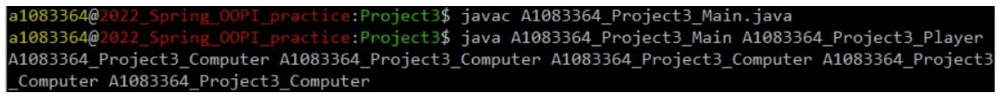

# OOP-IncanGold

## 使用說明
本次 Project 共有十一個程式檔,分別為 A1083364_Project3_Main.java、
A1083364_Project3_Game.java、A1083364_Project3_Environment.java、
A1083364_Project3_Card.java、A1083364_Project3_Treasure.java、
A1083364_Project3_Gemstone.java、A1083364_Project3_Artifact.java、
A1083364_Project3_Hazard.java、A1083364_Project3_Agent.java、
A1083364_Project3_Computer.java、A1083364_Project3_Player.java,在這邊主要
執行 A1083364_Project3_Main.java 的程式檔來完成本次作業的遊戲進行。

以下是在環境為 linux 課堂主機上進行編譯並執行
A1083364_Project3_Main.java 檔案的指令:

以下是遊戲資料檔案I/O 與玩家執行決策之參考流程圖

